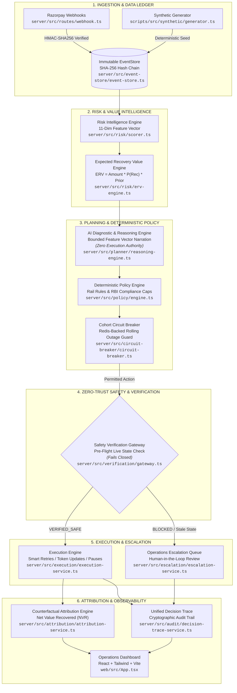

# Autonomous Revenue Recovery Control Plane

> **"AI predicts. Policy permits. Live verification confirms it's safe. Execution acts. Attribution proves what was actually recovered."**

The **Autonomous Revenue Recovery Control Plane** is a production-grade, event-sourced financial recovery system designed for Indian recurring subscription rails (**UPI AutoPay, Cards, and eNACH**). Built for the Razorpay AI Buildathon, it replaces naive, static retry loops with an intelligent, multi-layer control loop that computes real-time instrument health trajectories, estimates Expected Recovery Value (ERV), synthesizes clinical diagnostic reasoning via AI, strictly enforces deterministic rail policies and RBI compliance invariants, guards every money-moving action with a zero-trust verification gateway, and mathematically measures net recovered revenue through counterfactual attribution.

---

## 🏛️ System Architecture



---

## ⚖️ Implementation Status: Real vs. Simulated

| Component | Status | Architectural Detail |
| :--- | :--- | :--- |
| **Webhook Ingestion** | **100% Real** | Real HTTP receiver on `/api/webhooks/razorpay`, HMAC-SHA256 verified, raw-body preserved, and deduplicated via `razorpay_event_id`. |
| **EventStore Ledger** | **100% Real** | PostgreSQL 16 append-only ledger with SHA-256 hash chaining, advisory locks, and cryptographic integrity verification. |
| **Database & Cache** | **100% Real** | Real local PostgreSQL 16 (`:5432`) and Redis 7 (`:6379`) backing relational projections, idempotency tracking, and cohort states. |
| **Risk Scoring & ERV** | **100% Real** | Mathematical 11-dimension `RiskFeatureVector` calculation, health trajectory classification (`HEALTHY`, `DEGRADING`, `TERMINAL`), and ERV prioritization. |
| **AI Diagnostic Engine** | **100% Real** | Structured schema-validated clinical diagnosis (Gemini 1.5 Flash / OpenAI GPT-4o-mini with deterministic fallback) strictly grounded in feature vectors with **Zero Execution Authority**. |
| **Policy Engine** | **100% Real** | Deterministic rule matrix enforcing RBI ₹15,000 AFA caps, cooldown windows, max billing-cycle contact frequency, and grace period pauses. |
| **Circuit Breakers** | **100% Real** | Rolling-window cohort breaker backed by Redis (`ioredis`) with state restoration across restarts and a 10-sample statistical guard. |
| **Verification Gateway** | **100% Real** | 4-point pre-action verification check with fail-closed live state validation and PostgreSQL `action_executions` idempotency. |
| **Razorpay API Actions** | **Real / Simulated** | Executes live API requests (`chargeSubscription`, `pauseSubscription`) when active credentials are provided; falls back cleanly to local execution simulation with test keys. |
| **Financial Attribution** | **100% Real** | Counterfactual uplift engine computing Gross Recovered MRR, Net Value Recovered (NVR), and baseline loss estimates. |
| **Operations Dashboard** | **100% Real** | Full React 18 + Vite dashboard with live Top Recovery Opportunities queue, health sparklines, decision trace inspector, and circuit breaker metrics. |

---

## ⚡ Quickstart

### Prerequisites
- **Node.js**: `v20.x` or `v22.x`
- **Docker**: For running PostgreSQL 16 and Redis 7

### 1. Start Infrastructure Containers
```bash
docker compose up -d
```
*Starts PostgreSQL on `localhost:5432` and Redis on `localhost:6379`.*

### 2. Install Dependencies
```bash
npm install
```

### 3. Initialize Database Schema & Migrations
```bash
npm run db:reset
```
*Applies all 5 SQL migrations, creating relational tables, ledger schema, and unique indexes.*

### 4. Seed Synthetic Subscription Lifecycle Data
```bash
npm run seed:synthetic
```
*Generates 100 realistic subscriptions (Card, UPI AutoPay, eNACH) with 600+ event-sourced ledger events with 100% hash integrity.*

### 5. Execute Autonomous Pipeline Batch Run
```bash
npm run pipeline:batch
```
*Executes the complete control loop (Risk Scorer → ERV → Planner → Policy → Verification → Execution/Attribution) and populates the financial scorecard.*

### 6. Start the Control Plane Server & Dashboard
```bash
npm run dev
```
- **Dashboard UI**: [http://localhost:5173](http://localhost:5173)
- **API Server**: [http://localhost:4000](http://localhost:4000)

---

## 🔍 How to Verify Live Webhook Ingestion (End-to-End Checklist)

1. Start the application servers:
   ```bash
   npm run dev
   ```
2. In a second terminal, start the Smee webhook proxy:
   ```bash
   npx smee-client --url https://smee.io/wl5DMMFla94Wbz43 --target http://localhost:4000/api/webhooks/razorpay
   ```
3. Trigger a state change in Razorpay Dashboard Test Mode (e.g. Cancel or Halt subscription `sub_TXW1raR9Uus3ch`) or dispatch an authentic HMAC-SHA256 signed event payload.
4. Verify the logs in both terminals:
   - **Smee terminal**: `POST http://localhost:4000/api/webhooks/razorpay - 200`
   - **Dev server terminal**: `{"event":"subscription.halted","status":"halted","sequenceNumber":2988,"msg":"Razorpay webhook successfully ingested and projected to event store"}`
5. Verify in PostgreSQL that the event was appended to the immutable chain and projected into `subscriptions`:
   ```sql
   SELECT sequence_number, event_type, subscription_id, hash FROM events ORDER BY sequence_number DESC LIMIT 1;
   SELECT subscription_id, status FROM subscriptions WHERE subscription_id = 'sub_TXW1raR9Uus3ch';
   ```

---

## 📂 Project Structure

```text
├── server/          # Fastify API server, policy engine, verification gateway, AI narrator & EventStore
├── web/             # React 18 / Vite / Tailwind CSS operations dashboard & decision trace viewer
├── shared/          # Shared TypeScript domain models, schemas, and event contracts
├── scripts/         # Synthetic data generator, seeders, batch runners, and demo bootstrap utilities
└── docs/            # Architecture specifications, pitch deck, and compliance runbooks
```

---

## ⚠️ Known Limitations

1. **Live Razorpay Execution vs. Simulation**:
   - Live REST API calls and webhooks are ingested when active keys (`RAZORPAY_KEY_ID`, `RAZORPAY_KEY_SECRET`) are present in `.env`.
   - With placeholder keys, money-moving actions (`chargeSubscription`, `pauseSubscription`) execute through a local simulation branch so reviewers can evaluate the system cold without bank credentials.
   - Pre-action **Verification Gateway** checks strictly fail closed: any failure to verify live state returns `BLOCK / INTERNAL_VERIFICATION_ERROR`.
2. **AI Reasoning Boundary**:
   - The AI diagnostic engine produces narrative justifications grounded in the `RiskFeatureVector`. It has **Zero Execution Authority** and cannot bypass policy rules, override circuit breakers, or initiate unpermitted charges.
3. **External SMS/WhatsApp Delivery**:
   - Customer notifications use structured abstractions ready for production integration with enterprise IdPs and SMS gateways (Twilio, Gupshup).

---

## 📜 License

MIT © 2026 Autonomous Revenue Recovery Control Plane Team
