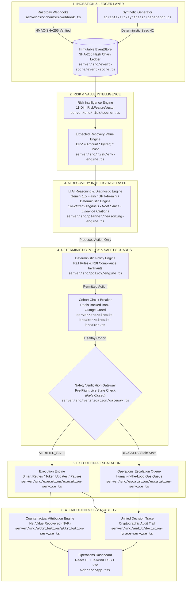

# Autonomous Revenue Recovery Control Plane

> **"AI predicts. Policy permits. Live verification confirms it's safe. Execution acts. Attribution proves what was actually recovered."**

[](https://buildathon-bice.vercel.app)
[](https://github.com/Katakam-Krupavathi/razorpay_buildathon_project/actions)

🌐 **Live Production Dashboard**: **[https://buildathon-bice.vercel.app](https://buildathon-bice.vercel.app)**

The **Autonomous Revenue Recovery Control Plane** is a production-grade, event-sourced financial recovery system designed for Indian recurring subscription rails (**UPI AutoPay, Cards, and eNACH**). Built for the Razorpay AI Buildathon, it replaces naive, static retry loops with an intelligent, multi-layer control loop that computes real-time instrument health trajectories, estimates Expected Recovery Value (ERV), synthesizes clinical diagnostic reasoning via AI, strictly enforces deterministic rail policies and RBI compliance invariants, guards every money-moving action with a zero-trust verification gateway, and mathematically measures net recovered revenue through counterfactual attribution.

---

## 🏛️ System Architecture & Pipeline Flow



---

## 🤖 The Crucial Role of AI in the Architecture

In typical recovery systems, retries are driven by hardcoded time delays (e.g. "retry in 24 hours"). In the **Autonomous Revenue Recovery Control Plane**, AI is integrated as an intelligent diagnostic and planning layer ([`server/src/planner/reasoning-engine.ts`](file:///server/src/planner/reasoning-engine.ts) and [`server/src/ai/llm-client.ts`](file:///server/src/ai/llm-client.ts)) that transforms raw error codes into clinical financial diagnoses:

### 1. Multi-Dimensional Feature Grounding
The AI does not receive vague text; it receives a structured **11-Dimensional `RiskFeatureVector`** derived from the ledger:
- **Consecutive Failures & Velocity**: Rate of decline over the last 24h/72h.
- **Days to Expiry**: Proximity to card/mandate expiry date.
- **AFA Compliance Delta**: Subscription amount compared to the RBI ₹15,000 threshold.
- **Rail Specifics**: Behavioral priors for UPI AutoPay vs. Cards vs. eNACH.
- **Historical Recovery Rate**: Past success probability for this customer cohort.

### 2. Structured Diagnostic Schema & Evidence Citations
The AI generates structured, schema-validated JSON outputs:
- **Clinical Diagnosis**: Explains *why* the failure occurred and why a specific recovery strategy is mathematically optimal.
- **Root-Cause Classification**: Identifies underlying drivers (`CARD_EXPIRY_RISK`, `INSUFFICIENT_FUNDS`, `MANDATE_LIMIT_EXCEEDED`, `BANK_DEGRADE`, etc.).
- **Evidence Citations**: References specific `eventId` hashes from the ledger to eliminate hallucination.
- **Confidence Scoring**: Assigns a calibrated confidence score ($0.0 \dots 1.0$) used in decision weighting.

### 3. Strict Safety Boundary: Zero Execution Authority
Financial systems require absolute safety. This architecture enforces a **Zero Execution Authority** principle:
- **AI Proposes, Policy Disposes**: The AI engine can **only propose** candidate actions. It has **zero direct access** to execute API calls or move funds.
- **Deterministic Gatekeeping**: Every proposal must pass through the **Deterministic Policy Engine** (RBI rules), **Cohort Circuit Breakers** (bank outage protection), and the **Verification Gateway** (live state pre-flight check) before any execution occurs.
- **Deterministic Fallback**: When cloud LLM keys are absent, the system seamlessly uses a mathematical reasoning engine to guarantee 0-latency, 100% reproducible execution.

---

## 🚀 Key System Capabilities

- **Indian Subscription Rail Awareness**:
  - **UPI AutoPay**: Smart retry scheduling aligned to typical salary cycles and UPI processing windows.
  - **Cards**: Proactive expiry nudges (0–20 days prior to expiration) avoiding hard declines.
  - **eNACH**: Strict debit presentation cooldowns preventing penalty fees.
- **Regulatory Compliance Invariants**:
  - **RBI ₹15,000 AFA Cap**: Automatically detects mandates exceeding ₹15,000 and routes them to customer step-up authentication instead of repeated failing debits.
  - **Contact Throttling**: Strict 1-nudge-per-cycle limit to prevent customer spam.
  - **Grace-Period Pauses**: Pauses high-LTV accounts during transient issues rather than allowing terminal churn.
- **Cryptographic Auditability**:
  - Every failure, prediction, decision, and payment is stored in a **SHA-256 hash-chained PostgreSQL EventStore**.
  - Any tampering breaks the hash chain, enabling provable compliance audits.
- **Counterfactual Net Value Recovered (NVR)**:
  - Tracks true incremental lift above a natural recovery baseline, isolating proactive saves from reactive retries.

---

## 🌐 Live Deployment & Dashboard

| Environment | URL | Details |
| :--- | :--- | :--- |
| **Production Dashboard (Vercel)** | **[https://buildathon-bice.vercel.app](https://buildathon-bice.vercel.app)** | Live hosted React 18 / Tailwind CSS control plane |
| **Local Dashboard** | **`http://localhost:5173`** | Local Vite dev server |
| **Local API Server** | **`http://localhost:4000`** | Fastify backend API & Webhook receiver |

---

## ⚡ Quickstart

### Prerequisites
- **Node.js**: `v20.x` or `v22.x` (or `v24.x`)
- **Docker**: For running PostgreSQL 16 and Redis 7

### 1. Start Infrastructure Services
```bash
docker compose up -d
```
*Starts PostgreSQL on `localhost:5432` and Redis on `localhost:6379`.*

### 2. Install Dependencies
```bash
npm install
```

### 3. Initialize Database Schema & Migrations
```bash
npm run db:reset
```
*Applies all 5 SQL migrations, creating relational tables, ledger schema, and unique indexes.*

### 4. Seed Synthetic Subscription Lifecycle Data
```bash
npm run seed:synthetic
```
*Generates 100 realistic subscriptions (Card, UPI AutoPay, eNACH) with 600+ event-sourced ledger events with 100% hash integrity.*

### 5. Execute Autonomous Pipeline Batch Run
```bash
npm run pipeline:batch
```
*Executes the complete control loop (Risk Scorer → ERV → AI Diagnostic → Policy → Verification → Execution/Attribution) and populates the financial scorecard.*

### 6. Start the Control Plane Server & Dashboard
```bash
npm run dev
```
- **Dashboard UI**: [http://localhost:5173](http://localhost:5173)
- **API Server**: [http://localhost:4000](http://localhost:4000)

---

## 🔍 How to Verify Live Webhook Ingestion (End-to-End Checklist)

1. Start the application servers:
   ```bash
   npm run dev
   ```
2. In a second terminal, start the Smee webhook proxy:
   ```bash
   npx smee-client --url https://smee.io/wl5DMMFla94Wbz43 --target http://localhost:4000/api/webhooks/razorpay
   ```
3. Trigger a state change in Razorpay Dashboard Test Mode (e.g. Cancel or Halt subscription `sub_TXW1raR9Uus3ch`) or dispatch an authentic HMAC-SHA256 signed event payload.
4. Verify the logs in both terminals:
   - **Smee terminal**: `POST http://localhost:4000/api/webhooks/razorpay - 200`
   - **Dev server terminal**: `{"event":"subscription.halted","status":"halted","sequenceNumber":2988,"msg":"Razorpay webhook successfully ingested and projected to event store"}`
5. Verify in PostgreSQL that the event was appended to the immutable chain and projected into `subscriptions`:
   ```sql
   SELECT sequence_number, event_type, subscription_id, hash FROM events ORDER BY sequence_number DESC LIMIT 1;
   SELECT subscription_id, status FROM subscriptions WHERE subscription_id = 'sub_TXW1raR9Uus3ch';
   ```

---

## 📂 Project Structure

```text
├── server/          # Fastify API server, policy engine, verification gateway, AI narrator & EventStore
│   ├── src/ai/               # LLM clients (Gemini 1.5 Flash / GPT-4o-mini) & structured schemas
│   ├── src/risk/             # 11-dimension RiskFeatureVector & ERV formula engines
│   ├── src/planner/          # AI reasoning engine & diagnostic action proposer
│   ├── src/policy/           # Deterministic rail rules & RBI compliance engine
│   ├── src/circuit-breaker/  # Redis-backed cohort circuit breaker
│   ├── src/verification/     # 4-point zero-trust pre-action verification gateway
│   ├── src/execution/        # Action execution engine (smart retries, token updates, pauses)
│   ├── src/attribution/      # Counterfactual attribution & Net Value Recovered (NVR) engine
│   └── src/event-store/      # SHA-256 hash-chained immutable event ledger
├── web/             # React 18 / Vite / Tailwind CSS operations dashboard & decision trace viewer
├── shared/          # Shared TypeScript domain models, schemas, and event contracts
├── scripts/         # Synthetic data generator, seeders, batch runners, and demo bootstrap utilities
└── docs/            # Architecture specifications, pitch deck, and compliance runbooks
```

---

## 📡 Core API Reference

| Endpoint | Method | Description |
| :--- | :--- | :--- |
| `/health` | `GET` | System health check (verifies PostgreSQL pool & Redis ping). |
| `/api/health` | `GET` | Detailed component health and circuit breaker status. |
| `/api/attribution/scorecard` | `GET` | Financial metrics: Monitored ARR, At-Risk MRR, Recovered MRR, NVR. |
| `/api/opportunities` | `GET` | Top recovery opportunities ranked by Expected Recovery Value (ERV). |
| `/api/instruments` | `GET` | Monitored instruments with real-time health scores & trajectory badges. |
| `/api/audit/decision-trace/:id` | `GET` | End-to-end cryptographic decision trace with AI diagnostic explanation. |
| `/api/compliance/report` | `GET` | RBI compliance audit report (AFA cap checks, contact frequency). |
| `/api/pipeline/run` | `POST` | Triggers the complete autonomous recovery agent batch run. |
| `/api/webhooks/razorpay` | `POST` | Webhook receiver with HMAC-SHA256 signature verification. |

---

## 📜 License

MIT © 2026 Autonomous Revenue Recovery Control Plane Team
