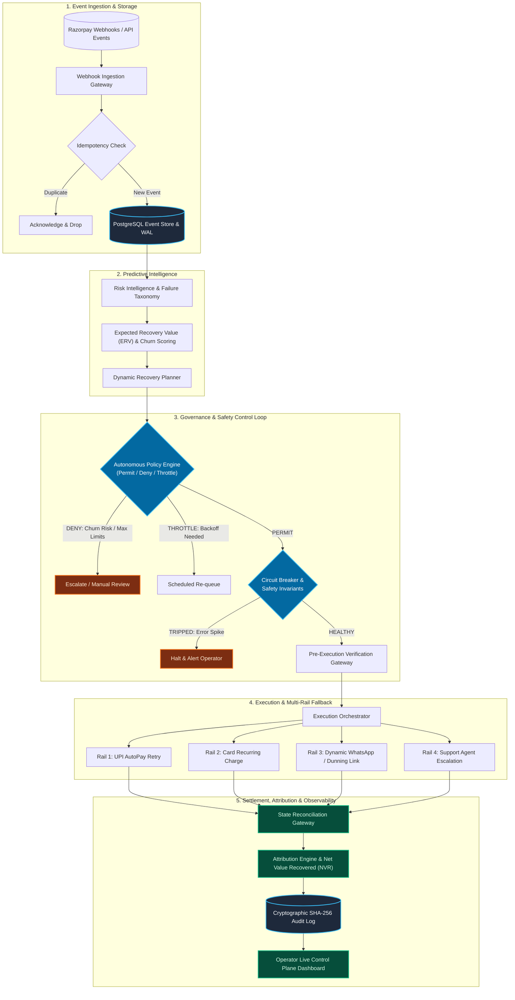

# Autonomous Revenue Recovery Control Plane — Architecture Specification

This document details the end-to-end architecture, domain invariants, data flows, and subsystem specifications of the **Autonomous Revenue Recovery Control Plane** for Razorpay mandate-aware subscriptions.

---

## 1. End-to-End Architectural Dataflow

The control plane follows a closed-loop control model where every payment failure event is ingested, evaluated against predictive models, checked by autonomous policy rules, gated by circuit-breaker safety invariants, verified before execution, executed across multi-rail fallback channels, reconciled, attributed, and recorded into an immutable audit log.



---

## 2. Textual Flow Diagram

```
[Razorpay Webhook: payment.failed]
                │
                ▼
      ┌───────────────────┐
      │ 1. Ingestion Gate │  ── Verify Signature & Idempotency Key
      └───────────────────┘
                │
                ▼
      ┌───────────────────┐
      │  2. Event Store   │  ── Append-Only PostgreSQL Immutable Event Log
      └───────────────────┘
                │
                ▼
      ┌───────────────────┐
      │ 3. Risk Engine    │  ── Classify Failure (RBI Limit, Insufficient Funds, Bank Outage)
      └───────────────────┘
                │
                ▼
      ┌───────────────────┐
      │  4. ERV Engine    │  ── Compute Expected Recovery Value = (P(rec) * Amount) - Cost
      └───────────────────┘
                │
                ▼
      ┌───────────────────┐
      │ 5. Recovery Plan  │  ── Select Optimal Recovery Action Sequence & Timings
      └───────────────────┘
                │
                ▼
      ┌───────────────────┐
      │ 6. Policy Engine  │  ── Evaluate Safety Rules (Permit / Deny / Throttle)
      └───────────────────┘
                │ [PERMIT]
                ▼
      ┌───────────────────┐
      │ 7. Circuit Breaker│  ── Check Sliding-Window Error Thresholds (Redis)
      └───────────────────┘
                │ [CLOSED / HEALTHY]
                ▼
      ┌───────────────────┐
      │ 8. Verify Gateway │  ── Confirm Mandate Active & Pre-Debit Notification Sent
      └───────────────────┘
                │
                ▼
      ┌───────────────────┐
      │ 9. Execution Rail │  ── UPI AutoPay / Card Recurring / Dynamic Dunning Link
      └───────────────────┘
                │
                ▼
      ┌───────────────────┐
      │ 10. Reconciliation│  ── Confirm Razorpay Settlement & Balance Capture
      └───────────────────┘
                │
                ▼
      ┌───────────────────┐
      │ 11. Attribution   │  ── Compute Net Value Recovered (NVR = Recovered - Fees)
      └───────────────────┘
                │
                ▼
      ┌───────────────────┐
      │ 12. Audit & Dash  │  ── Append SHA-256 Hash Chain & Stream to Operator UI
      └───────────────────┘
```

---

## 3. Subsystem Breakdown

### 1. Webhook Ingestion & Event Store

- **Responsibility**: Ingest webhook payloads from Razorpay (`invoice.payment_failed`, `subscription.paused`, `mandate.revoked`, `payment.captured`).
- **Guarantees**: HMAC-SHA256 signature verification, millisecond idempotency deduplication, and transactional append to the PostgreSQL event store.

### 2. Risk Intelligence & Failure Cause Taxonomy

- **Taxonomy Categories**:
  - `insufficient_funds`: Temporary balance shortfall; optimal retry aligns with salary cycles (1st–5th or month-end).
  - `temporary_bank_downtime`: Core banking / NPCI switch failure; exponential backoff (1h, 4h, 12h).
  - `mandate_limit_exceeded`: RBI recurring transaction cap (₹15,000 / ₹1,00,000 threshold); triggers step-up auth dunning link.
  - `expired_card_instrument`: Card expired or replaced; reroutes to mandate update workflow.
  - `fraud_risk_block`: High-risk or velocity violation; immediately denied for automated retry.

### 3. Expected Recovery Value (ERV) & Churn Propensity Engine

- **Formula**:
  $$\text{ERV} = (\mathbb{P}(\text{Recovery} \mid \text{Context}) \times \text{Invoice Amount}) - \text{Intervention Cost}$$
- **Churn Propensity**: Evaluates user sensitivity to communication friction. If churn risk exceeds the threshold, automated noisy dunning is suppressed in favor of silent mandate re-presentation.

### 4. Autonomous Policy Engine (Permit / Deny / Throttle)

- **Rules Evaluated**:
  - _Rule 1 (Max Attempt Cap)_: Never exceed 3 recovery attempts per billing cycle for a single customer.
  - _Rule 2 (Quiet Hours)_: Do not trigger intrusive dunning communications between 22:00 and 08:00 IST.
  - _Rule 3 (Mandate State Invariant)_: Never attempt auto-debit if mandate status is `revoked` or `paused`.
  - _Rule 4 (Velocity Guardrail)_: Max 500 recovery operations per 10-minute window globally.

### 5. Circuit Breaker & Safety Invariants

- **States**: `CLOSED` (Normal), `OPEN` (Tripped / Safety Halt), `HALF_OPEN` (Canary Probe).
- **Triggers**: If upstream bank failure rate exceeds 15% across a 5-minute rolling window, trip to `OPEN` to prevent batch failure penalties from Razorpay/NPCI.

### 6. Pre-Execution Verification Gateway

- **Invariants**:
  - Mandate token validity confirmed in cache/database.
  - RBI 24-hour pre-debit SMS/notification compliance satisfied.
  - Idempotency lease acquired in Redis prior to dispatching charge request.

### 7. Multi-Rail Fallback Execution Engine

- **Rail 1 (Primary)**: Seamless UPI AutoPay / Recurring Card Charge.
- **Rail 2 (Smart Dunning)**: Personalized WhatsApp / SMS / Email interactive payment link.
- **Rail 3 (Fallback)**: Temporary grace period extension + human support agent escalation queue.

### 8. Attribution & Net Value Recovered (NVR) Engine

- **Accounting**:
  $$\text{NVR} = \sum \text{Recovered Amount} - \sum (\text{Gateway Fees} + \text{SMS/Notification Costs} + \text{Dispute Reserves})$$
- Tracks autonomous recovery rate vs. baseline control group.

### 9. Forensic Audit Log & Replay Engine

- Immutable event log where each entry contains `sha256(previous_hash + current_event_payload)` for complete non-repudiation.
- Supports deterministic point-in-time replay to inspect past policy decisions.

### 10. Operator Dashboard UI

- Live system status, real-time event timeline, circuit breaker manual trip/reset toggles, and ERV distribution charts.

---

## 4. State Machine: Invoice Recovery Lifecycle

```
               [ INVOICE PAYMENT FAILED ]
                           │
                           ▼
                    [ EVALUATE RISK ]
                           │
                           ▼
                    [ COMPUTE ERV ]
                           │
             ┌─────────────┴─────────────┐
             ▼                           ▼
      [ ERV >= Threshold ]        [ ERV < Threshold ]
             │                           │
             ▼                           ▼
      [ EVALUATE POLICY ]         [ ESCALATE / WRITE OFF ]
             │
      ┌──────┴──────────────────────┐
      │                             │
 [ PERMITTED ]               [ DENIED / THROTTLED ]
      │                             │
      ▼                             ▼
[ CIRCUIT BREAKER: CLOSED ]   [ BACKOFF & RE-SCHEDULE ]
      │
      ▼
[ VERIFY MANDATE & PRE-DEBIT ]
      │
      ▼
[ DISPATCH RECOVERY ATTEMPT ]
      │
      ├──────────────────────────────┐
      ▼                              ▼
 [ SUCCESS ]                     [ FAILURE ]
      │                              │
      ▼                              ▼
[ RECONCILE & ATTRIBUTE ]      [ RETRY COUNT < MAX? ]
      │                              │
      ▼                        ┌─────┴─────┐
[ AUDIT LOG RECORDED ]         ▼           ▼
                           [ YES ]      [ NO ]
                              │            │
                     [ SCHEDULE NEXT ] [ ESCALATE ]
```

---

## 5. Security & Compliance Invariants

1. **Zero Plaintext Credentials**: Never store raw card numbers, CVVs, or bank credentials. Only Razorpay tokens (`token_xxx`) and masked identifiers are stored.
2. **Webhook Cryptographic Integrity**: Every webhook payload is rejected unless its signature matches `crypto.createHmac('sha256', secret).update(body).digest('hex')`.
3. **RBI Mandate Compliance**: Automatic pre-debit advisory compliance checks before executing recurring debits above threshold.
4. **Idempotency Locks**: Redis distributed lock (`redlock` pattern) per `invoice_id` prevents duplicate concurrent execution runs.
